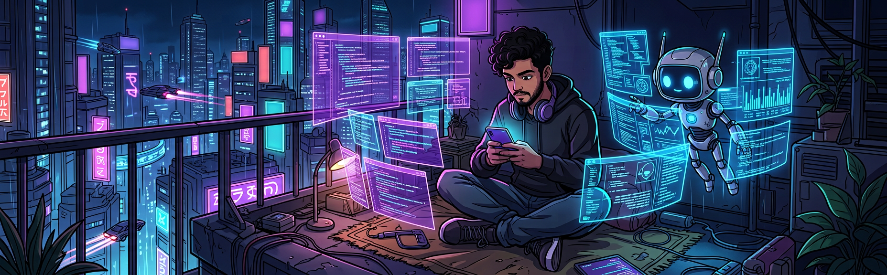
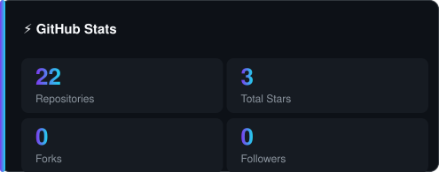
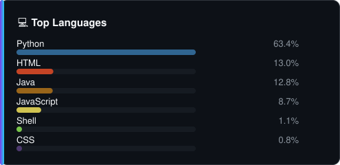

<div align="center">



<br/><br/>


# Hi, I'm Saurabh

**🤖 AI-First Developer &nbsp;•&nbsp; 📚 BCA Student &nbsp;•&nbsp; 📱 Codes 100% from a phone (Termux)**

<a href="https://git.io/typing-svg">

</a>

<br/>


<a href="https://saurabh-gzp.github.io"></a>

</div>

---

## 👨‍💻 About Me

```yaml
name:      Saurabh
role:      AI-First Developer
education: BCA Student
location:  India
setup:     Android phone + Termux (no laptop, no PC)
philosophy: If a phone can run it, I can build it
```

- 🤖 **AI-First Developer** — I design autonomous AI agents, multi-agent systems and LLM API gateways
- 📚 **BCA Student** — Bachelor of Computer Applications, self-taught builder
- 📱 **No laptop. No PC. Only a phone.** — every project here was written, tested & shipped from an Android phone using **Termux**
- 🔬 Currently exploring **neuro-symbolic AI, spiking neural networks & agentic tool-calling**
- 🛠️ I build tools that solve real problems — email automation, security scanning, live train tracking
- 💬 Ask me about **Termux workflows, on-device AI agents, prompt engineering**

---

## 📊 GitHub Stats

> Self-hosted stat cards — generated from the GitHub API every 6 hours, so they can never go down.

<div align="center">
  
  
</div>

<div align="center">
  
</div>

<div align="center">
<picture>
  <source media="(prefers-color-scheme: dark)" srcset="https://raw.githubusercontent.com/Saurabh-gzp/Saurabh-gzp/output/github-contribution-grid-snake-dark.svg" />
  <source media="(prefers-color-scheme: light)" srcset="https://raw.githubusercontent.com/Saurabh-gzp/Saurabh-gzp/output/github-contribution-grid-snake.svg" />
  
</picture>
</div>

---

## 🛠️ Tech Stack

<div align="center">

**Languages**


**AI / LLM**


**Tools & Platforms**


</div>

---

## 🚀 Featured Projects

<table align="center" style="border-collapse:separate;border-spacing:10px">
  <tr>
    <td width="320" align="left" valign="top" style="background:#0D1117;border:1px solid #30363D;border-radius:10px;padding:16px">
      <a href="https://github.com/Saurabh-gzp/toy-drive" style="text-decoration:none">
        <b style="color:#F8FAFC">toy-drive</b><br/>
        <span style="color:#8B949E;font-size:12px">3D driving playground — pure SVG + synthesized audio (three.js + canvas)</span><br/><br/>
        <span style="font-size:12px"><span style="color:#F1E05A">●</span> JavaScript</span>
      </a>
    </td>
    <td width="320" align="left" valign="top" style="background:#0D1117;border:1px solid #30363D;border-radius:10px;padding:16px">
      <a href="https://github.com/Saurabh-gzp/qwen2api" style="text-decoration:none">
        <b style="color:#F8FAFC">qwen2api</b><br/>
        <span style="color:#8B949E;font-size:12px">Qwen Web → OpenAI/Anthropic/Gemini/Responses API gateway with function calling</span><br/><br/>
        <span style="font-size:12px"><span style="color:#3572A5">●</span> Python</span>
      </a>
    </td>
  </tr>
  <tr>
    <td width="320" align="left" valign="top" style="background:#0D1117;border:1px solid #30363D;border-radius:10px;padding:16px">
      <a href="https://github.com/Saurabh-gzp/Sentinel-AI-Security-Scanner" style="text-decoration:none">
        <b style="color:#F8FAFC">Sentinel-AI-Security-Scanner</b><br/>
        <span style="color:#8B949E;font-size:12px">On-device agentic AI security scanner — decompiles APKs & live-renders websites</span><br/><br/>
        <span style="font-size:12px"><span style="color:#E34C26">●</span> HTML</span>
      </a>
    </td>
    <td width="320" align="left" valign="top" style="background:#0D1117;border:1px solid #30363D;border-radius:10px;padding:16px">
      <a href="https://github.com/Saurabh-gzp/nexus-agent" style="text-decoration:none">
        <b style="color:#F8FAFC">nexus-agent</b><br/>
        <span style="color:#8B949E;font-size:12px">Autonomous multi-agent CLI that runs on your phone — Supervisor · Coder · Critic · RAG</span><br/><br/>
        <span style="font-size:12px"><span style="color:#3572A5">●</span> Python</span>
      </a>
    </td>
  </tr>
  <tr>
    <td width="320" align="left" valign="top" style="background:#0D1117;border:1px solid #30363D;border-radius:10px;padding:16px">
      <a href="https://github.com/Saurabh-gzp/VidGrab" style="text-decoration:none">
        <b style="color:#F8FAFC">VidGrab</b><br/>
        <span style="color:#8B949E;font-size:12px">Android video & audio downloader for 10+ platforms (up to 8K), APK + Kotlin</span><br/><br/>
        <span style="font-size:12px"><span style="color:#E34C26">●</span> HTML</span>
      </a>
    </td>
    <td width="320" align="left" valign="top" style="background:#0D1117;border:1px solid #30363D;border-radius:10px;padding:16px">
      <a href="https://github.com/Saurabh-gzp/TrainTrack" style="text-decoration:none">
        <b style="color:#F8FAFC">TrainTrack</b><br/>
        <span style="color:#8B949E;font-size:12px">Indian Railways CLI — PNR status, live train status, seat availability</span><br/><br/>
        <span style="font-size:12px"><span style="color:#3572A5">●</span> Python</span>
      </a>
    </td>
  </tr>
</table>

<details>
<summary>📖 More Projects</summary>

| Project | What it does |
|---------|-------------|
| [**deepseek-agent**](https://github.com/Saurabh-gzp/deepseek-agent) | Autonomous multi-tool CLI agent running entirely on DeepSeek |
| [**sutra**](https://github.com/Saurabh-gzp/sutra) | Multi-agent CLI powered by Mistral — plan → parallel agents → review |
| [**instant-mail-cli**](https://github.com/Saurabh-gzp/instant-mail-cli) | Temp email + OTP watcher CLI — real Gmail support, 4 mail services |
| [**getcontact-tool**](https://github.com/Saurabh-gzp/getcontact-tool) | Caller ID lookup — number info, tags, spam check |
| [**openinbox-tempmail**](https://github.com/Saurabh-gzp/openinbox-tempmail) | 10-minute disposable email in your terminal, instant OTP alerts |
| [**temp-mail**](https://github.com/Saurabh-gzp/temp-mail) | TempMail Ninja — 10-minute disposable email, live OTP receiver |

</details>

---

## 📫 Let's Connect

<div align="center">

<a href="https://github.com/Saurabh-gzp">

</a>
<a href="https://saurabh-gzp.github.io">

</a>

<br/><br/>


<br/>

<sub>Profile crafted with care — designed, built & deployed from an Android phone</sub>

</div>
